# zCore

[](https://github.com/rcore-os/zCore/actions)
[](https://rcore-os.github.io/zCore/)
[](https://coveralls.io/github/rcore-os/zCore?branch=master)

Reimplement [Zircon][zircon] microkernel in safe Rust as a userspace program!


## Getting started

Environments：

- [Rust toolchain](http://rustup.rs)
- [QEMU](https://www.qemu.org)

### Developing environment info

- current rustc -- rustc 1.66.0-nightly (1898c34e9 2022-10-26)
- current rust-toolchain -- nightly-2022-10-27
- current qemu -- 4.2.1 -> 5.2.0 -> 6.2.0 -> 7.0.0 -> 8.0.93

Clone repo and pull prebuilt fuchsia images:

```sh
git clone --recursive https://github.com/kern-crates/zCore.git
cd zCore
```
Use docker container as standand develop environment, please refer to [scripts/docker](https://github.com/kern-crates/zCore/tree/main/scripts/docker).

### Run zcore in libos mode

#### Run zcore in linux-libos mode

- step 1: Prepare Alpine Linux rootfs:

  ```sh
  make rootfs
  ```

- step 2: Compile & Run native Linux program (Busybox) in libos mode:

  ```sh
  cargo run --release --features "linux libos" -- /bin/busybox [args]
  ```

  OR

  ```sh
  make run PLATFORM=libos LINUX=1 LOG=warn
  ```

  You can also add the feature `graphic` to show the graphical output (with [sdl2](https://www.libsdl.org) installed).

  To debug, set the `LOG` environment variable to one of `error`, `warn`, `info`, `debug`, `trace`.

#### Run native Zircon program (shell) in zircon-libos mode:

- step 1: Compile and Run Zircon shell

  ```sh
  cargo run --release --features "zircon libos" -- prebuilt/zircon/x64/bringup.zbi
  ```

  The `graphic` and `LOG` options are the same as Linux.

### Run zcore in bare-metal mode

#### Run Linux shell in  linux-bare-metal mode:
---
**Quick start for x86_64**

```sh
make run LINUX=1 ARCH=x86_64 PLATFORM=qemu MODE=debug LOG=debug

```

**Quick start for RISCV64**

```sh
make image ARCH=riscv64
make run ARCH=riscv64 LINUX=1
# OR: make run LINUX=1 MODE=release SMP=1 ARCH=riscv64 PLATFORM=qemu LOG=debug
```

**Quick start for AARCH64**

```sh
make image ARCH=aarch64
make run LINUX=1 ARCH=aarch64 PLATFORM=qemu LOG=warn
```

---
- step 1: Prepare Alpine Linux rootfs:

  ```sh
  make rootfs ARCH=[x86_64|riscv64|aarch64]
  ```

- step 2: Create Linux rootfs image:

  Note: Before below step, you can add some special apps in zCore/rootfs

  ```sh
  make image ARCH=[x86_64|riscv64|aarch64]
  ```

- step 3: Build and run zcore in  linux-bare-metal mode:

  ```sh
  make run MODE=release LINUX=1 [LOG=warn] [GRAPHIC=on] [ACCEL=1]
  ```

#### Run Zircon shell in zircon-bare-metal mode:

- step 1: Build and run zcore in  zircon-bare-metal mode:

  ```sh
  make run MODE=release [LOG=warn] [GRAPHIC=on] [ACCEL=1]
  ```

- step 2: Build and run your own Zircon user programs:

  ```sh
  # See template in zircon-user
  cd zcore-zircon-user && make zbi MODE=release
  
  # Run your programs in zCore
  make run MODE=release USER=1 [LOG=warn] [GRAPHIC=on] [ACCEL=1]
  ```

## Testing

### LibOS Mode Testing

#### Zircon related

Run Zircon official core-tests:

```sh
cd zcore-tests && make zircon-core-test-libos
```

#### Linux related

Run Linux musl libc-tests for CI:

```sh
cd zcore-tests && make linux-libc-test-libos
# Check `zcore-tests/linux_libc_test_x86_64_libos.log` for results.
```

### Bare-metal Mode Testing

#### Zircon related

Run Zircon official core-tests on bare-metal:

```sh
cd zcore-tests && make zircon-core-test
```

#### Linux related

Run Linux musl libc-tests for CI:

```sh
cd zcore-tests && make linux-libc-test-baremetal ARCH=[x86_64|riscv64|aarch64]
```

Run Linux other tests (eg: busybox):
```sh
cd zcore-tests && make linux-other-test-baremetal ARCH=[x86_64|riscv64|aarch64]
```

You can use `zcore-tests/linux_libc_test*.py -t app` & `zcore-tests/testcases/linux_libc_test/*.txt` to test specified apps.

`zcore-tests/testcases/*_test/*.txt` includes all `FAILED` apps (We need YOUR HELP to fix bugs!)

## Graph/Game

snake game: <https://github.com/rcore-os/rcore-user/blob/master/app/src/snake.c>

### Step1: compile usr app

We can use musl-gcc compile it in x86_64 mode

### Step2: change zcore for run snake app first.

change zCore/zCore/main.rs L176
vec!["/bin/busybox".into(), "sh".into()]
TO
vec!["/bin/snake".into(), "sh".into()]

### Step3: prepare root fs image, run zcore in linux-bare-metal mode

exec:

```sh
cd zCore #zCore ROOT DIR
make rootfs
cp ../rcore-user/app/snake rootfs/bin #copy snake ELF file to rootfs/bin
make image # build rootfs image
cd zCore #zCore kernel dir
make run MODE=release LINUX=1 GRAPHIC=on
```

Then you can play the game.
Operation

- Keyboard
  - `W`/`A`/`S`/`D`: Move
  - `R`: Restart
  - `ESC`: End
- Mouse
  - `Left`: Speed up
  - `Right`: Slow down
  - `Middle`: Pause/Resume

## Doc

```
make doc
```

### RISC-V 64 porting info

- [porting riscv64 doc](./docs/porting-rv64.md)

## Components

### Overview



[zircon]: https://fuchsia.googlesource.com/fuchsia/+/master/zircon/README.md
[kernel-objects]: https://github.com/PanQL/zircon/blob/master/docs/objects.md
[syscalls]: https://github.com/PanQL/zircon/blob/master/docs/syscalls.md

### Hardware Abstraction Layer

|                           | Bare Metal | Linux / macOS     |
| :------------------------ | ---------- | ----------------- |
| Virtual Memory Management | Page Table | Mmap              |
| Thread Management         | `executor` | `async-std::task` |
| Exception Handling        | Interrupt  | Signal            |

### Small Goal & Little Plans

- <https://github.com/rcore-os/zCore/wiki/Plans>
## Dev Status

🚧 Working In Progress

- 2020.04.16: Zircon console is working on zCore! 🎉
